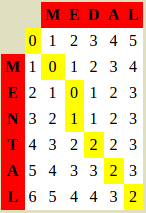

.. title: Edit Distance
.. slug: edit-distance
.. date: 2015-06-02 18:30:41 UTC+05:30
.. tags: mathjax, algorithm, dynamic-programming, python
.. link: 
.. description: 
.. type: text

This post introduces the problem of finding the similarity between two strings and quantifying it using a measure called *Edit Distance*. Then, we see an efficient way of calculating the edit distance between two strings.

.. TEASER_END

Why Edit Distance?
------------------

While dealing with strings, at times it may be necessary to ascertain just how similar two strings are to each other. For example, intuitively, one can see that the strings "ROME" and "ROMEO" are very similar to each other, considering the strings as just a sequence of letters, of course. However, in some cases, it may benefit to have a concrete, quantitative notion of similarity (or difference, as the case may be) between two strings.

An example application which can make use of such a notion of similarity between strings is spelling correction. For instance, when you type in the word *mispelling* in an application with a spell checker (say, Chrome or MS-Word), it indicates that the word is incorrect, and then suggests corrections like *misspelling*, *dispelling*, *spelling*, etc. Where do these suggestions come from? The answer is that the spell-checker automatically retrieves the words within an in-built dictionary that are the most similar to the misspelt word. This can only be done if there is a standard, numeric value that quantifies the similarity between two words.

One such notion of similarity is *Edit Distance*. Given two strings :math:`a` and :math:`b`, the Edit Distance between :math:`a` and :math:`b` is a score denoting the number of *edits* required to transform :math:`a` to :math:`b`. For instance, the Edit Distance between the strings "ROME" and "ROMEO" is 1 because it requires only one edit to transform "ROME" to "ROMEO" (add the 'O' at the end). The lesser the Edit Distance between two strings, the greater is the similarity.

One of the amazing things about such a general definition of similarity between two strings is that it can be used not just for a pair of strings, but a pair of sequences in general! That is, if any data can be expressed as a sequence, then Edit Distance is a valid measure of similarity. For Example, if you have an ordered list of movie preferences and would like to find out who of your friends has most similar tastes in movies, you could ask all of them to give you their preference lists, and then you could run Edit Distance to check which of these lists has the least Edit Distance from your list! This may not be the best measure of similarity, but it certainly is a candidate. Other applications include computational biology, where the "string" to be processed is a genome.

Levenshtein Distance
--------------------

Edit Distance, defined as "the number of edits required to transform a string into another" is easy to understand, but it is rather underspecified. What constitutes an *edit* is not made clear. Due to this, there is actually a variety of Edit Distance measures, each considering a different set of operations as edits. The most popular version of Edit Distance was defined by Levenshtein, and is therefore referred to as the `Levenshtein Distance <http://en.wikipedia.org/wiki/Levenshtein_distance>`_. Levenshtein Distance considers the following 3 types of edits:

* Insertion (Say, "ROME" to "ROMEO")
* Deletion (Say, "CARDS" to "CARS")
* Substitution (Say, "DIG" to "BIG")

Each edit contributes 1 point to the Edit Distance score. For example, the Levenshtein distance between "MEDAL" and "MENTAL" is 2, as follows:

1. In "MEDAL", substituting 'D' with 'N' gives "MENAL",
2. In "MENAL", inserting 'T' gives "MENTAL".

Variants of Edit Distance exist which do not consider Substitution as an edit, or consider Transposition (say, "FORM" to "FROM") to be a single edit, and so on. For the rest of this post, we will consider the Levenshtein Distance, although the others are quite similar.

Calculating the Levenshtein Distance
------------------------------------

In order to compute the Levenshtein Distance, a clearer definition of the metric is required. Fortunately, Levenshtein Distance renders itself very easily to a recursive formulation. Here, :math:`lev()` is the function to calculate the Levenshtein distance, which accepts two strings :math:`a` and :math:`b`. Here, :math:`a-1` denotes the string with the last character removed.

.. math::
   lev(a, b) = \begin{cases}
               \max (len(a), len(b)) & \text{if}\ \min (len(a), len(b)) = 0 \\
               \min (lev(a-1, b) + 1, lev(a, b-1) + 1, lev(a-1, b-1) + rep) & \text{where}\ rep = 0 \text{ if last characters of } a \text{ and } b \text{ are equal, else } 1
	       \end{cases}

If that looks intimidating, don't fret! On breaking it down, we understand that this is just explicit handling of the three types of edits specified above, and the base case.

* :math:`lev(a-1, b) + 1` handles the case of deletion from the first string,
* :math:`lev(a, b-1) + 1` handles the case of insertion into the first string,
* :math:`lev(a-1, b-1) + rep` handles the case of substitution, where the distance is increased only if the last letter of both strings is different and thus needs to be substituted.
* :math:`\max (len(a), len(b))` handles the base case when one of the two strings is empty.

This can be better understood in the form of a table as follows:

This table was obtained from an `online Levenshtein distance calculator <http://www.let.rug.nl/~kleiweg/lev/>`_. It's extremely useful to not only calculate the Edit Distance between two strings, but also visualize how the strings were transformed.

A Recursive Program
-------------------

As a first attempt, we can directly convert the recursive definition outlined above into a recursive implementation. The code is as follows:

.. code:: python
    :number-lines:

    def levenshtein_recursive(str1, str2):

        if len(str1) == 0:
            return len(str2)
        if len(str2) == 0:
            return len(str1)

        ins = levenshtein_recursive(str1[:-1], str2) + 1
        dlt = levenshtein_recursive(str1, str2[:-1]) + 1
        sub = levenshtein_recursive(str1[:-1], str2[:-1]) + (0 if str1[-1] == str2[-1] else 1)

        return min(ins, dlt, sub)

This recursive function starts at the bottom-right corner of the Levenshtein distance table, and then calls the function on previous cells, filling up the value as the recursive calls return.

However, this recursive function performs a lot of redundant computations, because after each entry in the table is computed, it is returned to the caller and then the value is thrown away. Unfortunately, there are multiple ways to reach each cell in the table! For instance, if the function is called on two strings "MENTAL" and "MEDAL" as ``levenshtein_recursive("MENTAL", "MEDAL")``, then, while processing, a call ``levenshtein_recursive("MENTA", "MEDA")``, i.e. the call after the last character is removed from both strings, will be reached in the following ways:

1. Using the ``ins`` call: ``levenshtein_recursive("MENTAL", "MEDAL")`` -> ``levenshtein_recursive("MENTA", "MEDAL")`` -> ``levenshtein_recursive("MENTA", "MEDA")``
2. Using the ``dlt`` call: ``levenshtein_recursive("MENTAL", "MEDAL")`` -> ``levenshtein_recursive("MENTAL", "MEDA")`` -> ``levenshtein_recursive("MENTA", "MEDA")``
3. Using the ``sub`` call: ``levenshtein_recursive("MENTAL", "MEDAL")`` -> ``levenshtein_recursive("MENTA", "MEDA")``

As a result, the number of calls will grow exponentially. It becomes impossible to apply this algorithm to strings over merely 10 characters in length on a typical home computer. Can we do better?

Dynamic Programming Implementation
----------------------------------

As seen in previous posts, the problem with the recursive implementation is repeated calls with the same parameters, repeating the work done. The solution is, then, to store the previously computed values and use them when needed so that the values are not recomputed again and again.

In the case of Fibonacci and Catalan numbers, the function had only one parameter. Therefore a 1-D array was enough to store the results of the prior computations. However, in this case, the function has 2 parameters, and therefore, to cover all combinations of input parameters passed to the function, the storage cache must be 2-dimensional, i.e. a table.

We can fill the table in a bottom-up manner, starting at the top-left corner and using the already filled information to fill up the adjacent cells. Thus we don't need to wait for values that are yet to be filled, and multiple calls will not end up at the same place, repeating our work.

This can be implemented as follows:

.. code:: python
    :number-lines:

    def levenshtein_dp(str1, str2):

        distances = []
        distances.append(list(range(len(str2)+1)))

        for i in range(1, len(str1)+1):
            distances.append([])
            distances[i].append(distances[i-1][0] + 1)

            for j in range(1, len(str2)+1):
                ins = distances[i-1][j] + 1
                dlt = distances[i][j-1] + 1
                sub = distances[i-1][j-1] + (0 if str1[i-1] == str2[j-1] else 1)

                distances[i].append(min(ins, dlt, sub))
    
        return distances[-1][-1]

Here, line 6 loops through each row of the table. Line 8 handles the base case of an empty string. Line 10 loops through each cell of the current row, and the following block of code puts the Levenshtein distance formula in action. Finally, the last cell of the table is returned.

**Code**

The code is available on the `github repository <https://github.com/DJSagarAhire/blog-code/tree/master/003>`_ accompanying the site.

**Exercise**

1. Write a program to find the number of paths from cell (0, 0) to (``m-1``, ``n-1``) in an ``m`` * ``n`` matrix, with ``m`` and ``n`` given as input. You are only allowed to move left, right, or down while traversing the matrix. *Bonus*: What does this have to do with the recursive implementation of Levenshtein distance discussed above?

2. Optimise the dynamic programming implementation so that it requires storage space for only 2 rows rather than the entire table.

